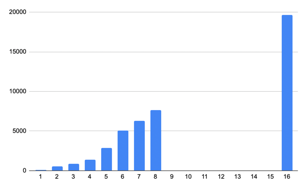

#Blokų grandinių technologijos
##1-oji užduotis: Hash generatoriaus kūrimas.
####Liudvikas Radvilavičius MIF ISI 2 kursas, 3 semestras, 2022. 

###Programos paleidimo instrukcijos
Programa paleidžiama per komandinę eilutę, į kurią būtina įvesti parametrus:
- jeigu norima įvesti tekstą ranka, tuomet naudojamas *-h* flagas, pvz.: "*-h lorem ipsum*"
- jeigu norima skaityti tekstą iš failų, tuomet naudojamas *-f* flagas, pvz.: "*-h failas1.txt failas2.txt failas3.txt*"

###Eksperimentinio tyrimo-analizės užduotys
1. Testinių įvedimo failų pavyzdžių rezultatai. Tenkinamos visos sąlygos, failų "pathuose" matosi kurioje eilutė kas analizuojama:
   `Hash from file files-for-testing/1-Only-one-char-difference/test.txt:
   1182435518162778431297457031850184734525921578572905451850031820
   Hash from file files-for-testing/1-Only-one-char-difference/test2.txt:
   0999662971402152666628079610031401812233251890908678006862868971
   Hash from file files-for-testing/2-1000-char-files/test.txt:
   0922457577751845695326758843000366371843423138447530622609064733
   Hash from file files-for-testing/2-1000-char-files/test2.txt:
   7772003437519645093826219678960868215750215932705389817517921153
   Hash from file files-for-testing/3-1000-char-files-1-char-difference/test.txt:
   4603463886790716350891387738415691478268544420632038471098845891
   Hash from file files-for-testing/3-1000-char-files-1-char-difference/test2.txt:
   0922457577751845695326758843000366371843423138447530622609064733
   Hash from file files-for-testing/4-Empty-file/test.txt:
   0084846527055259214725091158109980736160493570301660439414668851`
2. Hash'ai visuomet vienodo ilgio, to paties failo hash'as visuomet toks pats.
3. [Konstitucijos](https://www.dropbox.com/s/ce83ry9a4d9642z/konstitucija.txt?dl=0) hash'avimo grafikas:

Horizantalioje ašyje - Konstitucijos skirsniai, vertikalioje - laikas milisekundėmis. Panašu į aritmetinę progresiją, menką parabolę. Visą failą truko užhash'uoti apie 20 sekundžių. 
4. 